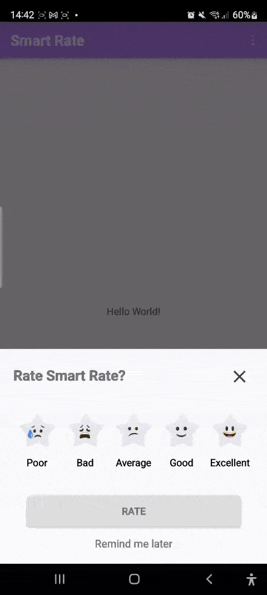
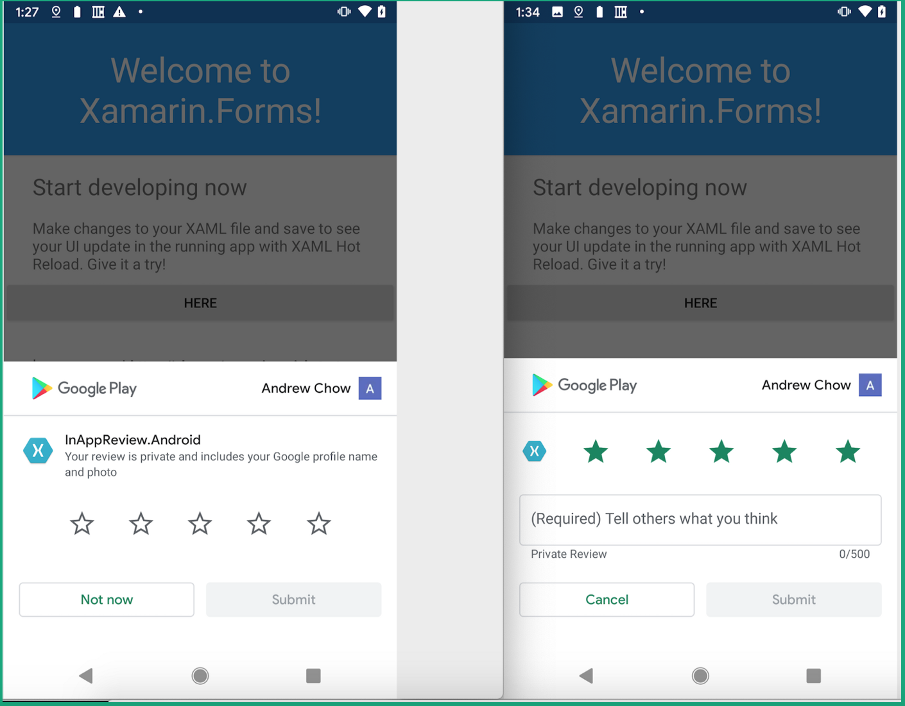
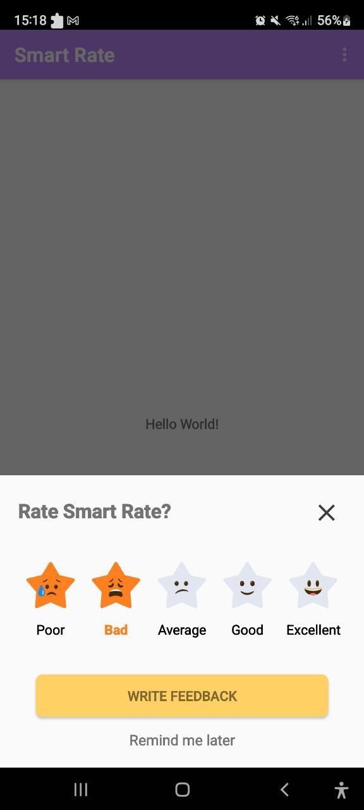
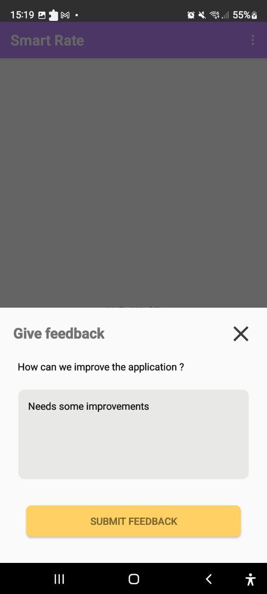
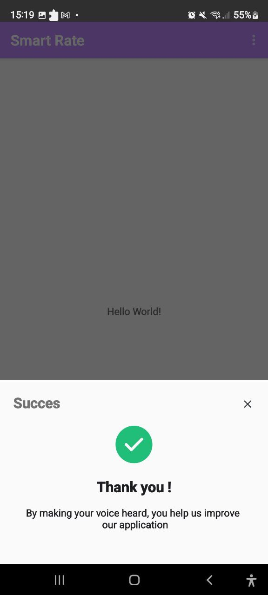

[](https://opensource.org/licenses/Apache-2.0)
[](http://developer.android.com/index.html)
[](https://android-arsenal.com/api?level=21)
[](https://jitpack.io/#wdikiz/SmartRate_Android)

# SmartRate Android

SmartRate is an Android library designed to manage app ratings and feedback efficiently. SmartRate helps you collect negative feedback directly through your server, allowing you to improve your app without negatively impacting its visibility on the Play Store.



pic demo from : devblogs

It provides a user-friendly and visually appealing dialog that encourages users to rate the app on Google Play. The Call-To-Action (CTA) button dynamically changes based on the user's rating:

- **Write Feedback:** if the review is between 1 & 3 stars ths user is invited to send a feedback 

- **Rate:** - If the review is 4 or 5 stars, the Google in-app review flow is launched



The library comprises three main views:

1. The primary review dialog.



2. The feedback view only for reviews between 1 & 3 stars.



3. The thank you view, which disappears after 5 seconds or upon closing.



## Getting Started

### Step 1: Add JitPack to your root build.gradle at the end of repositories:

```gradle
allprojects {
    repositories {
        ...
        maven { url 'https://jitpack.io' }
    }
}
```

### Step 2: Add the dependency

```gradle
implementation 'com.github.wdikiz:SmartRate_Android:1.0'
```

### Additional Dependencies

To enable all features of SmartRate, include the following dependencies:

```gradle
implementation 'com.google.android.play:review:2.0.1'
implementation 'com.android.volley:volley:1.2.1'
```

## Basic Usage

### Show Dialog

```java
SmartRate.init(MainActivity.this)
    .setAfterXLaunches(2)
    .setShowAgainAfterNegative(2)
    .setUrlFeedback("https://example.com/sendFeedback.php")
    .setInAppReviewEnabled(true)
    .setLaunchReviewDirectly(true)
    .setOnCloseClickListener(() -> {
        SharedPreferences prefs = MainActivity.this.getSharedPreferences("MyPrefs", Context.MODE_PRIVATE);
        prefs.edit().putBoolean("DialogClosedWithoutAction", true).apply();
    })
    .setOnFeedbackClickListener(() -> {
        SmartRate.dontShowAgain(true, MainActivity.this);
    })
    .build();
```

### Explanation of Key Parameters

- **`setInAppReviewEnabled(true)`**: When set to true, SmartRate will trigger the in-app review flow from Google if the package name matches. This is highly recommended to keep enabled for a smoother user experience.

- **`setLaunchReviewDirectly(true)`**: If true, the in-app review launches immediately after the user selects 4 or 5 stars. If false, the user must confirm by clicking a button to proceed to the in-app review. It's recommended to keep this enabled for a seamless experience.

- **`SmartRate.dontShowAgain(true, YOURACTIVITY.this)`**: Ensures that once a user leaves negative feedback (1 to 3 stars) and submits feedback via the provided URL, the rating dialog won't be shown again to that user. However, if `setShowAgainAfterNegative(2)` is set, the dialog will reappear after the app is launched twice post negative feedback.

- **`setAfterXLaunches(2)`**: Configures the dialog to show after the app has been launched a specified number of times. This can be useful for engaging users who haven't interacted with the app over multiple sessions.

- **`setUrlFeedback("https://example.com/sendFeedback.php")`**: Configures the URL to send negative feedback, allowing you to gather insights and improve the app without affecting its visibility on the store. The following PHP script can be used on your server to handle feedback submissions:

```php
<?php
// Check if the request is POST
if ($_SERVER['REQUEST_METHOD'] === 'POST') {
    // Retrieve feedback from POST data
    $feedback = isset($_POST['feedback']) ? $_POST['feedback'] : '';
    $toEmail = 'wdik@gmail.com'; // Change to your email address
    $subject = 'New feedback for your app'; // Change the email subject
    $headers = 'From: noreply@yourdomain.com' . "
" .
               'Reply-To: noreply@yourdomain.com' . "
" .
               'X-Mailer: PHP/' . phpversion();

    if (mail($toEmail, $subject, $feedback, $headers)) {
        echo json_encode(array('success' => true, 'message' => 'Feedback sent successfully.'));
    } else {
        echo json_encode(array('success' => false, 'message' => 'Failed to send feedback.'));
    }
} else {
    echo json_encode(array('success' => false, 'message' => 'Unauthorized method.'));
}
?>
```

### Remind Me Later

The "Remind Me Later" functionality allows the dialog to reappear on the next launch of the app if the user closes the dialog without taking any action.

```java
SmartRate.init(MainActivity.this)
    .setAfterXLaunches(2)
    .setShowAgainAfterNegative(2)
    .setUrlFeedback("https://tferej.com/sendFeedback.php")
    .setInAppReviewEnabled(true)
    .setLaunchReviewDirectly(true)
    .setOnCloseClickListener(() -> {
        SharedPreferences prefs = MainActivity.this.getSharedPreferences("MyPrefs", Context.MODE_PRIVATE);
        prefs.edit().putBoolean("DialogClosedWithoutAction", true).apply();
    })
    .setOnFeedbackClickListener(() -> {
        SmartRate.dontShowAgain(true, MainActivity.this);
    })
    .build();
```

## Advanced Usage

### Custom Conditions

Customize when the dialog should be shown. By default, the dialog will be shown when the app is launched more than 3 times and more than 3 days after installation.

```java
SmartRate.init(MainActivity.this)
    .setAfterXLaunches(2) // App launched more than 2 times
    .setShowAgainAfterNegative(7) // Show again after 7 launch after negative feedback
    .setUrlFeedback("https://example.com/sendFeedback.php")
    .setInAppReviewEnabled(true)
    .setLaunchReviewDirectly(true)
    .setOnCloseClickListener(() -> {
        SharedPreferences prefs = MainActivity.this.getSharedPreferences("MyPrefs", Context.MODE_PRIVATE);
        prefs.edit().putBoolean("DialogClosedWithoutAction", true).apply();
    })
    .setOnFeedbackClickListener(() -> {
        SmartRate.dontShowAgain(true, MainActivity.this);
    })
    .build();
```

### Prevent the Dialog from Showing Again

```java
SmartRate.dontShowAgain(true, context);
```

## Language

SmartRate currently supports the following languages:

- English
- Arabic
- German
- Spanish
- French
- Italian
- Dutch
- Portuguese
- Turkish

## Support

SmartRate Android supports API level 21 and up.

## Contributing

    Fork it
    Create your feature branch (git checkout -b my-new-feature)
    Commit your changes (git commit -am 'Added some feature')
    Push to the branch (git push origin my-new-feature)
    Create new Pull Request

Please make sure to update the tests as appropriate.

## License

```
Licensed under the Apache License, Version 2.0 (the "License");
you may not use this file except in compliance with the License.
You may obtain a copy of the License at

http://www.apache.org/licenses/LICENSE-2.0

Unless required by applicable law or agreed to in writing, software
distributed under the License is distributed on an "AS IS" BASIS, 
WITHOUT WARRANTIES OR CONDITIONS OF ANY KIND, either express or implied.
See the License for the specific language governing permissions and
limitations under the License.
```

## Author

Wdikiz - wdik@gmail.com
